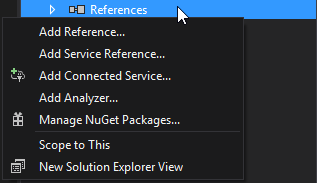

# cs-sockets-wrapper
A C# System.Net.Sockets Wrapper for possible easier use

# Usage
Via any git capable shell
```
cd YOURPROJECTFOLDER
git clone https://github.com/IceT-Clan/cs-sockets-wrapper
```
In Visual Studio:

Add cs-sockets-wrapper to Solution

1. Right-Click on the Solution of your Project in the Solution Explorer
2. Choose `Add` -> `Add existing Project...`
3. Open `cs-sockets-wrapper\Sockets.shproj`


Add new Reference

1. Right-Click on the Project wich needs to access the Sockets
2. Choose `Add` -> `Reference...`


or

1. Select the Project wich needs to access the Sockets
2. Right-Click on References
3. Choose `Add Reference...`



Add Sockets from Shared Projects
1. On the left panel choose `Shared Projects` -> `Solution`
2. Tick `Sockets`
3. Press `OK`


